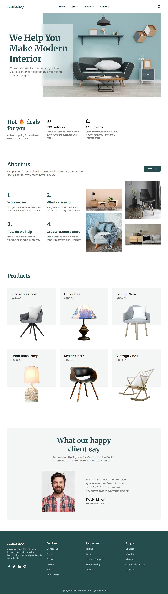

# 🪑 FurniShop – Responsive E-commerce Furniture Website
 
**Tech Stack:** HTML, CSS, JavaScript  
**Type:** Front-End Responsive Web Project  
Here’s a preview of the FurniShop homepage:



---

## 📌 Overview

**FurniShop** is a fully responsive and interactive e-commerce website template for a modern furniture store. Built from scratch using pure **HTML, CSS, and JavaScript**, this project demonstrates how to create a clean, mobile-friendly UI with dynamic features — perfect for front-end web development learners and portfolio enhancement.

---

## 🎯 Features

- ✅ Fully responsive design (mobile, tablet, desktop)
- ✅ Product listing grid with hover effects
- ✅ Add to Cart interactions (non-functional placeholder)
- ✅ Navigation bar with dropdown menu
- ✅ Smooth scroll and animations
- ✅ Clean and modern UI design

---

## 🛠️ Technologies Used

- **HTML5** – for structured and semantic markup  
- **CSS3** – for responsive layout and styling  
- **JavaScript** – for UI interactivity and navigation behavior  

---

## 🚀 Getting Started

1. **Clone the Repository**
   ```bash
   git clone https://github.com/yourusername/FurniShop_29-06-24.git

   cd FurniShop

2. Open index.html in your browser:

bash
Open with Live Server (VS Code) or double-click index.html

📂 Folder Structure

bash
FurniShop_29-06-24/
│
├── index.html
├── style.css
├── script.js
├── /images
└── /assets (if any fonts/icons used)


📈 Project Status
✅ Complete — Front-end template ready for extension
🔜 Future Scope:


🙌 Acknowledgements
This project was created for learning and demonstration purposes. Design inspired by modern UI trends in furniture e-commerce.

📬 Contact
Nikita Yadav
GitHub | LinkedIn | 📧 nikitayadav192004@gmail.com

🪄 License
This project is open source and free to use under the MIT License.

---

Let me know if you'd like:
- Deployment help (GitHub Pages / Netlify)
- A dark/light theme toggle feature added
- Screenshots or preview GIFs embedded


